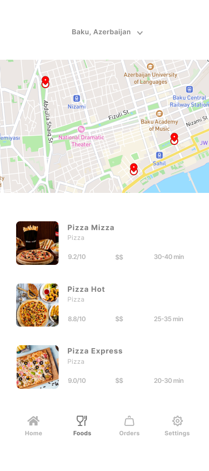
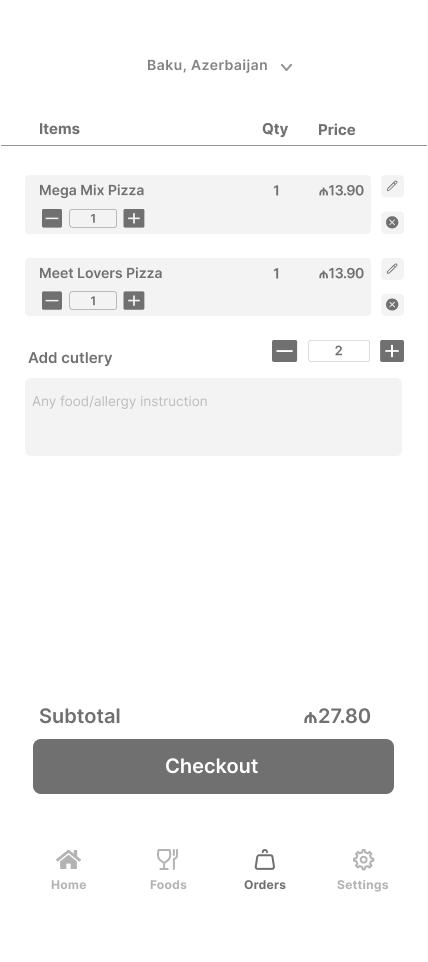

# Food Delivery App UI - Flutter

This is a well-designed Food Delivery App UI built using Flutter. The app follows the Model-View-Controller (MVC) architecture for better code organization and maintainability.

## Features

- Interactive home screen with food categories
- List of popular restaurants with details
- Food item suggestions

## Screens

1. **Home**: Displays food categories and popular restaurants.

## How to Run

1. Make sure you have Flutter installed on your machine.

2. Clone this repository to your local machine.

3. Open the project in your preferred code editor.

4. Run the following command in the terminal to install the required dependencies:
   ```
   flutter pub get
   ```

5. Connect your device or emulator.

6. Run the app using the following command:
   ```
   flutter run
   ```

## Screenshots






## UI Design

The UI design of this app is focused on providing an intuitive and visually appealing experience for users. The color scheme and typography are carefully selected to create a delightful atmosphere for food lovers. The use of images and icons enhances the overall user experience.

## Libraries Used

This project utilizes the following libraries:

- `flutter_svg`: For displaying SVG images in the app.
- `google_fonts`: For using custom Google Fonts in the app.

## Contribution

Contributions are welcome! If you find any issues or have suggestions for improvement, feel free to open an issue or submit a pull request.
